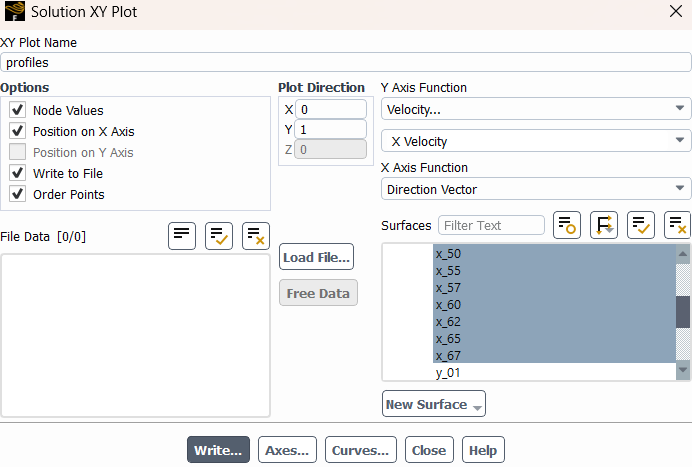

# Post processing tool for turbulent boundary layer velocity profiles from Ansys Fluent

## To use this tool you must first extract simulation results from Ansys Fluent
- plot Boundary layer profiles at different position
    - All lines' names on fluent must start with "x_"
    - If you are extracting profiles at different position, you must count the maximum number of digits in the whole and decimal parts
    - Example : 
        - if you have profiles at x = [1.2346, 23.4, 120]
                the maximum number of the whole parts is 3 and 4 for the decimal parts
        - Then all lines must be called "x_" then 3+4=7 digits
        - We will have "x_0012346" "x_0234000" "x_1200000"
        - This is important so that Fluent orders the profiles
- Save profiles as a xy file
        check the box "write to file"
        click on "write"

- Save the shear stress evolution on the wall (tau_w(x)) in an xy file as well
- Save the pressure gradient evolution (dp/dx(x)) in an xy file
- put all of these 3 files in the same directory

## Post processing

- Open the main.py script, you will find 2 sections to complete
    - "Input variables" : 
        - enter the directory containing "xy" files from Fluent
        - enter the files' names
        - enter the list of profile positions ! IN ORDER ! in the list called x
    - "Post processing" : choose the results to print and profiles and curves to plot
- Run the main.py script

## How to start
- put all the scripts in the same directory
- a "data" is given with an example of the files that need to be extracted from Fluent
- You can run the script using the files in "data" to get familiar with the code

## Important information
- In the code we consider Ue (the velocity far from the wall) to be the maximum velocity in the profile, which should work most of the time
    - If it doesn't you can extract only the boundary layer portion in the profile
